# SpotFit Database ERD

> 기반: `spotfit-web/supabase/migrations/20240101000000_initial.sql`
> DB: Supabase PostgreSQL + PostGIS

```mermaid
erDiagram
    sports {
        UUID id PK
        VARCHAR50 name "UNIQUE"
        VARCHAR50 category
        VARCHAR255 icon_url
        BOOLEAN is_active "DEFAULT true"
        TIMESTAMPTZ created_at
    }

    tags {
        UUID id PK
        VARCHAR50 name "UNIQUE"
        VARCHAR50 classification "실력|목적|연령|성별|장소|비용|인원"
        TIMESTAMPTZ created_at
    }

    users {
        UUID id PK
        VARCHAR255 phone_hash "UNIQUE, AES-256"
        VARCHAR30 nickname "UNIQUE"
        VARCHAR255 profile_image
        VARCHAR100 activity_region
        DECIMAL41 manner_score "DEFAULT 36.5"
        VARCHAR20 subscription_status "free|premium|expired"
        TIMESTAMPTZ subscription_expires_at
        BOOLEAN is_active "DEFAULT true"
        BOOLEAN workplace_verified
        BOOLEAN school_verified
        TIMESTAMPTZ created_at
        TIMESTAMPTZ updated_at
    }

    user_sports {
        UUID user_id FK
        UUID sport_id FK
    }

    user_tags {
        UUID user_id FK
        UUID tag_id FK
    }

    badges {
        UUID id PK
        VARCHAR50 name
        TEXT description
        VARCHAR50 condition_type "spot_count|manner_score|region_rank"
        INTEGER condition_value
        VARCHAR255 image_url
        TIMESTAMPTZ created_at
    }

    user_badges {
        UUID user_id FK
        UUID badge_id FK
        TIMESTAMPTZ earned_at
    }

    spots {
        UUID id PK
        UUID host_id FK
        UUID sport_id FK
        VARCHAR100 title
        TEXT description
        VARCHAR200 location_name
        DECIMAL107 latitude
        DECIMAL107 longitude
        BOOLEAN location_anonymized "NFR-3.4: 30일 후 익명화"
        INTEGER max_participants "2~50"
        INTEGER current_participants "DEFAULT 1"
        VARCHAR20 difficulty_level "beginner|intermediate|advanced"
        VARCHAR20 status "recruiting|full|in_progress|completed|cancelled"
        TIMESTAMPTZ starts_at
        TIMESTAMPTZ ends_at
        TIMESTAMPTZ created_at
        TIMESTAMPTZ updated_at
    }

    spot_tags {
        UUID spot_id FK
        UUID tag_id FK
    }

    participations {
        UUID id PK
        UUID spot_id FK
        UUID user_id FK
        VARCHAR20 status "joined|cancelled|no_show"
        BOOLEAN evaluation_completed "DEFAULT false"
        TIMESTAMPTZ joined_at
    }

    evaluations {
        UUID id PK
        UUID spot_id FK
        UUID evaluator_id FK
        UUID evaluated_id FK
        BOOLEAN is_positive
        JSONB score_items "punctuality|manner|skill|communication"
        TIMESTAMPTZ created_at
    }

    reports {
        UUID id PK
        UUID reporter_id FK
        UUID reported_id FK
        UUID spot_id FK "nullable"
        VARCHAR50 report_type "profanity|harassment|no_show|fraud|other"
        TEXT description
        VARCHAR20 status "pending|reviewed|resolved|dismissed"
        TIMESTAMPTZ created_at
    }

    chat_messages {
        UUID id PK
        UUID spot_id FK
        UUID user_id FK
        TEXT message
        VARCHAR20 message_type "text|notice|status"
        TIMESTAMPTZ created_at
    }

    subscriptions {
        UUID id PK
        UUID user_id FK
        VARCHAR20 plan_type "monthly|yearly"
        INTEGER amount
        VARCHAR255 toss_payment_key
        VARCHAR255 toss_order_id "UNIQUE"
        VARCHAR20 status "active|cancelled|expired"
        TIMESTAMPTZ starts_at
        TIMESTAMPTZ expires_at
        TIMESTAMPTZ created_at
    }

    notification_tokens {
        UUID user_id PK "FK → users"
        VARCHAR255 fcm_token
        VARCHAR20 device_type "ios|android|web"
        TIMESTAMPTZ updated_at
    }

    %% ── 사용자 ↔ 종목/태그/뱃지 (M:N) ──
    users ||--o{ user_sports : "선호 종목"
    sports ||--o{ user_sports : ""
    users ||--o{ user_tags : "선호 태그"
    tags ||--o{ user_tags : ""
    users ||--o{ user_badges : "뱃지 획득"
    badges ||--o{ user_badges : ""

    %% ── 스팟 ──
    users ||--o{ spots : "호스트 (host_id)"
    sports ||--o{ spots : "종목"
    spots ||--o{ spot_tags : ""
    tags ||--o{ spot_tags : "스팟 태그"

    %% ── 참여 ──
    spots ||--o{ participations : ""
    users ||--o{ participations : "참여"

    %% ── 평가 ──
    spots ||--o{ evaluations : ""
    users ||--o{ evaluations : "평가자 (evaluator_id)"

    %% ── 신고 ──
    spots |o--o{ reports : "신고 관련 스팟"
    users ||--o{ reports : "신고자 (reporter_id)"

    %% ── 채팅 ──
    spots ||--o{ chat_messages : ""
    users ||--o{ chat_messages : "발신"

    %% ── 구독/알림 ──
    users ||--o{ subscriptions : "구독 결제"
    users ||--o| notification_tokens : "FCM 토큰"
```

---

## 테이블 요약

| 테이블 | 역할 | 주요 특이사항 |
|---|---|---|
| `users` | 사용자 | phone_hash AES-256 암호화, manner_score 기본값 36.5 |
| `sports` | 운동 종목 (15종) | 축구·농구·배드민턴 등 |
| `tags` | 해시태그 (15개) | 실력·목적·연령·성별·장소·비용·인원 분류 |
| `user_sports` | 사용자 선호 종목 (M:N) | 복합 PK |
| `user_tags` | 사용자 선호 태그 (M:N) | 복합 PK |
| `badges` | 뱃지 정의 (5종) | condition_type + condition_value 조건 기반 |
| `user_badges` | 사용자 뱃지 획득 이력 | earned_at 포함 |
| `spots` | 스팟(파티) 핵심 테이블 | PostGIS 공간 인덱스, location_anonymized (30일 후 익명화) |
| `spot_tags` | 스팟 ↔ 태그 (M:N) | 복합 PK |
| `participations` | 스팟 참여 | UNIQUE(spot_id, user_id), evaluation_completed 플래그 |
| `evaluations` | 참가자 간 평가 | UNIQUE(spot_id, evaluator_id, evaluated_id), score_items JSONB |
| `reports` | 신고 | spot_id nullable |
| `chat_messages` | 스팟별 채팅 | Supabase Realtime 구독 대상 |
| `subscriptions` | 프리미엄 구독 결제 | toss_order_id UNIQUE (멱등성) |
| `notification_tokens` | FCM 푸시 토큰 | users와 1:1 (user_id PK) |

## RPC 함수

| 함수 | 역할 |
|---|---|
| `get_nearby_spots(lat, lng, radius, ...)` | PostGIS 기반 반경 내 스팟 조회 (필터: 종목·태그·날짜) |
| `get_rankings(period_type, ...)` | 기간별 랭킹 집계 (participations + completed spots 기준) |

## RLS 정책

- `SELECT` — 모든 테이블 공개 허용 (커스텀 JWT 사용으로 `auth.uid()` 미사용)
- `INSERT/UPDATE/DELETE` — API 라우트에서 `service_role` 키로만 처리 (RLS 우회)
- 예외: `chat_messages` INSERT는 프론트엔드 직접 허용 (Realtime 패턴)
